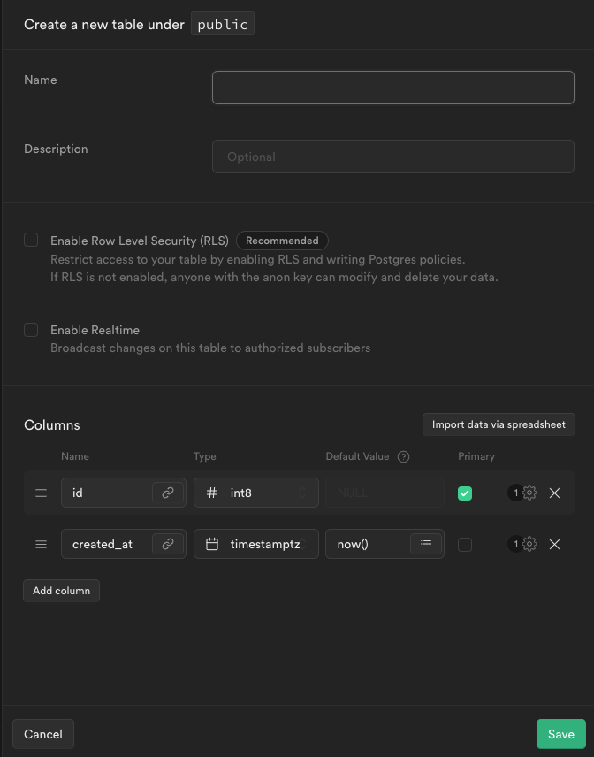

# Supabase について 

#### 開発部 石川

---

# [Supabase](https://supabase.com/) とは

- いわゆる BaaS（Backend as a Service）と呼ばれるもの
- Firebase の RDB 版
- オープンソース、セルフホスティング可
- Web, App 対応

---

# 大まかな機能

- Database（PostgreSQL）
- Authentication
- Storage
- Realtime
- Edge Funcitons （Beta ~ 2022/08/01）
- GraphQL

etc...

---

# サンプルコード（Web）や各機能について

<!-- _footer: Flutter https://supabase.com/docs/guides/with-flutter -->

---

## :one: Supabase プロジェクトの初期化

- https://supabase.com から GitHub ログイン
- プロジェクト名やパスワード、リージョン等を設定
  - 東京リージョン :o:

<!-- LT用 https://app.supabase.com/project/nlemkqykrspauaasknga -->

---

### テーブル作成

- SQL Editor か、Table Editor でテーブルを定義
  - UI の実装がまだ追いついていない
  - 細かい設定をしたい場合は SQL を書く必要がある



<!-- https://app.supabase.com/project/nlemkqykrspauaasknga/editor -->

---

## :two: SDK のインストール、クライアントの初期化

```bash
npm i @supabase/supabase-js
```

```TypeScript
import { createClient } from "@supabase/supabase-js";

const SUPABASE_URL = process.env.NEXT_PUBLIC_SUPABASE_URL;
const SUPABASE_ANON_KEY = process.env.NEXT_PUBLIC_SUPABASE_ANON_KEY;

export const supabase = createClient(SUPABASE_URL, SUPABASE_ANON_KEY);
```

- anon
  - クライアントへ渡して OK
- service_role
  - サーバー側でしか使用してはいけない。RLS の設定を無視できる管理者用のキー

---

## :three: 認証

```TypeScript
import { supabase } from "どっか"; // 2で初期化したインスタンスをimport

const user = supabase.auth.user(); // ユーザー情報を取得

const { user, session, error } = await supabase.auth.signIn({
  email: 'example@email.com',
  password: 'example-password',
});
```

- auth.users テーブルにデータがたまってく
- SMS 認証
- ソーシャルログイン
  - Apple, Discord, Facebook, GitHub, Google, Notion, Twitter...

---

## :four: CRUD

```TypeScript
type Task = { id: string, title: string, ... };
const { data, error } = await supabase
  .from<Task>("tasks")
  // .select("*");
  // .insert([{ title: 'foo' }], { upsert: true })
  // .update({ title: 'hoge' })
  // .delete()
```

各テーブルの API のドキュメントが自動で生成

<!-- _footer: SDK側でキャッシュはしてないので注意 -->

---

### Realtime

- DB に変更があった時に、WebSocket を用いてクライアント側へデータを送信することができる
- ダッシュボードから、有効化したいテーブルを選ぶことで使用可能

```TypeScript
const tasksListener = supabase
  .from('tasks')
  .on('*', payload => { // INSERT | DELETE...
    console.log('Change received!', payload)
  })
  .subscribe();

// tasksListener.unsubscribe();
```

---

## :five: RLS（Row Level Security）

- PostgreSQL の機能
  - ポリシーを指定することで行単位でのセキュリティの設定が可能
- Supabase 側で[便利関数](https://supabase.com/docs/guides/auth/row-level-security#helper-functions)がいくつか用意されている
  - `auth.uid()` -> リクエストを行ったユーザーの ID を返す、など

---

### 具体例

```SQL
CREATE POLICY "policy_name"
ON public.tasks
FOR SELECT USING ( -- 既存レコードには USING、新規レコードには WITH CHECK
  auth.uid() = user_id -- 条件式
);
```

↑ tasks テーブルを取得したときに、リクエストを行ったユーザー ID と tasks.user_id が一致する場合のみ OK

**細かいアクセス制限が必要な場合には、基本的にこの RLS のポリシーで設定する**

<!-- _footer: クライアント側で自由に DB へアクセスされるのを防ぐためにも、基本的に RLS の有効化は必須-->

<!-- ---
- Database Functions
  - SQL で定義
  - supabase.rpc("関数名")
  - triggerを作成して、〇〇テーブルへのinsertをトリガーに関数実行、みたいなことができる
- Edge Functions
  - Deno ランタイム上で JS / TS を実行可能 -->

---

## :six: GraphQL

- Supabase で GraphQL も利用可能に :tada:
- 有効化するにはダッシュボードでボタンおすだけ
  - `/graphql/v1`
  - `apiKey: anon key`
- 自動で各テーブルの Query, Mutation を生成

```SQL
comment on schema public is e'@graphql({"inflect_names": true})';
-- snake_case → PascalCase
```

```SQL
select graphql.rebuild_schema(); -- GraphQLスキーマを再生成
```

<!-- https://nlemkqykrspauaasknga.supabase.co/graphql/v1 -->
<!-- header apiKey: anon key -->

---

## その他 :one:

- `Database Functions`や`Triggers`
  - トランザクション
  - 特定のデータの変更を検知して処理を実行
  - `Database Funcitons`はクライアント側から呼び出すことも可能（`supabase.rpc("関数名")`）
- `Edge Functios`
  - Deno ランタイム上で JS,TS を実行できる

DB をいじりたい場合 → `Database Functions`
低レイテンシーを必要とする場合 → `Edge Functions`

  <!-- 参考: - https://zenn.dev/hrtk/articles/supabase-nextjs-database-function-table - https://zenn.dev/matken/articles/use-user-info-with-supabase
  -->

---

## その他 :two:

- `supabase-cli`
  - Docker を使ったローカル開発
  - マイグレーション
  - `Edge Functions`の作成、デプロイ
  - v2からはTypeScriptに対応し、型の自動生成が可能（SDKの補完が効く）

---

# 所感

---

# :smile:

- 手早くバックエンド作れて幸せ
- 主要な機能は大体そろってる
  - PostgreSQL の機能を使えるため、細かいことも結構色々できそう
- API も直感的でわかりやすく、GraphQL も使える
- Twitter で「Supabase」についてつぶやくと、中の人がたまに反応してくれる（質問答えてくれた）

---

# :weary:

- SQL の学習コスト
  - テーブル定義、RLS、Database Functions など
- スケールしたとき大丈夫？
- すべての機能が Production Ready なわけではないので注意
- Web Push がない

---

### 全体的によさげ

- 個人、小規模のプロダクトは向いてそう
- どんどん伸びているサービスなので、今後の進化にも期待 :muscle::man::muscle:

---

# ご清聴ありがとうございました :wave:
